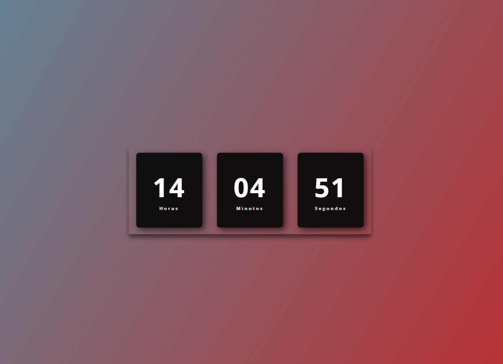

# Relógio Digital

Projeto simples que exibe um relógio digital em tempo real utilizando HTML, CSS e JavaScript.

## Descrição

Este projeto cria um relógio digital estilizado que mostra as horas, minutos e segundos atualizados a cada segundo, baseado no horário do sistema do usuário.

## Tecnologias Utilizadas

- HTML5
- CSS3
- JavaScript (ES6)

## Como usar

1. Clone este repositório ou baixe os arquivos.
2. Coloque a imagem do relógio na pasta `images` (ou ajuste o caminho da imagem conforme sua organização).
3. Abra o arquivo `index.html` em seu navegador.
4. O relógio será exibido e atualizado automaticamente.

## Estrutura do projeto

- `index.html`: Estrutura do relógio.
- `style.css`: Estilos visuais e layout.
- `script.js`: Lógica de atualização do horário.
- `images/relogio.png`: Imagem ilustrativa do projeto.

## Demonstração

O relógio mostra as horas, minutos e segundos com um design responsivo e agradável.
